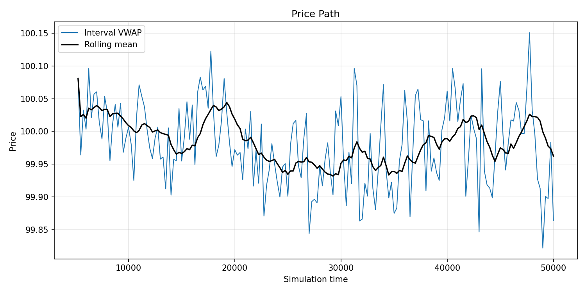
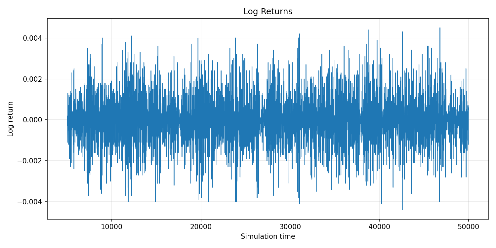
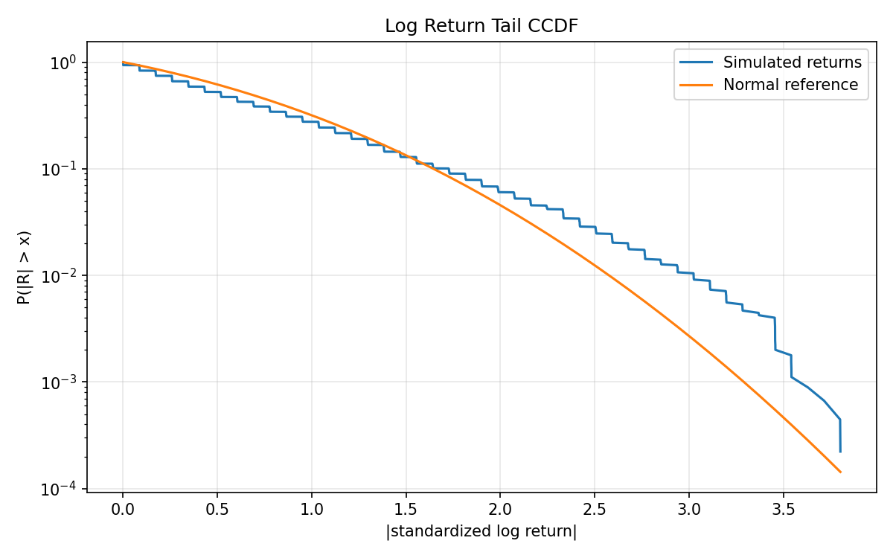
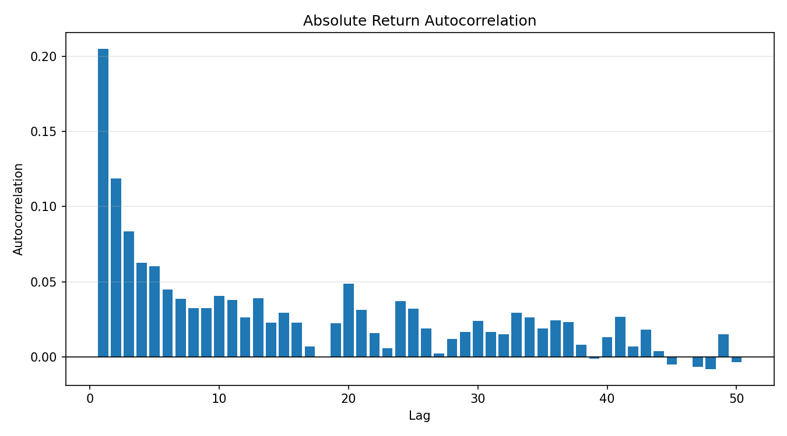

# Stock Market Simulation Project

This project simulates a stock market using agent-based modeling. Below are the instructions to set up and run the project.

## Prerequisites

- Python 3.x installed on your machine.

## Setup Instructions

### Option 1: Local Installation

1. **Clone the Repository:**
   ```bash
   git clone <repository-url>
   cd <repository-directory>
   ```
2. **Install Dependencies:**
Ensure you have pip installed. Then, install the required libraries using the requirements.txt file:
   ```bash
   pip install -r requirements.txt
   ```
3. **Run the sample simulation**
   ```bash
   python sample_simulation.py
   ```

### Option 2: Virtual Environment Setup
1. **Clone the Repository:**
   ```bash
   git clone <repository-url>
   cd <repository-directory>
   ```
2. **Create and Activate Virtual Environment:**
    Run the setup.py script to create and activate a virtual environment:
   ```bash
   python setup.py
   ```
   Follow the instructions printed in the terminal to activate the virtual environment.

3. **Run the sample simulation**
   ```bash
   python sample_simulation.py
   ```

## Sample Simulation

The simplest way to run the project is:

```bash
python sample_simulation.py
```

This runs a basic simulation and prints the final OHLCV output, for example:

```text

END OF SIMULATION

    open    high    low  close volume    time
0  63.31  100.00  63.31  94.12    871     0.0
1  94.12   94.13  93.70  93.77    888  1000.0
2  93.77   93.77  92.97  92.97    955  2000.0
3  92.97   93.00  91.73  91.81   1048  3000.0
4  91.81   91.81  90.98  90.99   1062  4000.0
5  90.99   90.99  90.17  90.19   1004  5000.0
6  90.19   90.19  89.58  89.59   1005  6000.0
7  89.59   89.59  89.12  89.13   1049  7000.0
8  89.13   89.16  88.80  88.81   1023  8000.0
9  88.81   88.81  88.40  88.44   1049  9000.0

```

It also saves the final agent results in the current working directory.

## Baseline Price Evolution Analysis

For a more detailed analysis of price evolution and return statistics, run:

```bash
python analysis/baseline_analysis.py \
  --scenario mixed \
  --max-time 50000 \
  --burn-in 5000 \
  --return-interval 10 \
  --price-interval 250 \
  --output-dir analysis/output/chartist_threshold_005
```

This creates analysis outputs in:

```text
analysis/output/chartist_threshold_005
```

The generated outputs include transaction paths, return paths, event logs, summary statistics and diagnostic plots.

Selected example plots are shown below.

### Price Path

Simulated price path with interval VWAP and rolling mean.



### Log Returns

Log returns computed from aggregated transaction prices.



### Return Tail Distribution

Empirical return tail compared with a normal reference distribution.



### Absolute Return Autocorrelation

Autocorrelation of absolute returns, used as a simple volatility clustering diagnostic.



